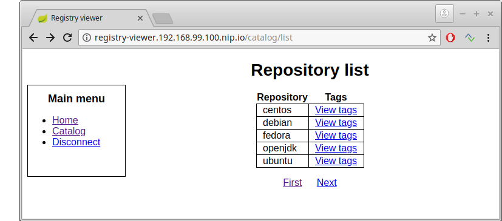

# Registry viewer


Registry Viewer is a web application for browsing Docker registries.
It uses version 2 of the registry API and allows both authenticated and
non authenticated login. By default the application displays form for
registry url and authentication settings. However, it is possible to
specify the login information at startup using environment properties.



## Instalation and configuration

### Requirements

Registry viewer is a Spring boot application which requires Java 8 to
run. To build this project the following software need to
be installed on your machine:

* Openjdk 1.8
* Maven 3.3.9 or higher

### Run and debug using Maven

Registry viewer is Spring boot application and can be run simply
using **spring-boot-maven-plugin**:

```
mvn spring-boot:run
```

Application listens on port 8080 by default. Port and other parameters
can be changed using Spring boot configuration options. The list with
these options can be found in
[Spring documentation](https://docs.spring.io/spring-boot/docs/1.5.10.RELEASE/reference/htmlsingle/#boot-features-customizing-embedded-containers).

It is possible to enable remote debugger which listens on port 5005:

```
mvn spring-boot:run
  -Drun.jvmArguments="-Xdebug -Xrunjdwp:transport=dt_socket,server=y,suspend=y,address=5005"
```

### Build

To build the application run:

```
mvn clean install
```

It will create
executable jar **registry-viewer.jar** in the **target**
directory. The file will contain embeded Tomcat servlet container
and all libraries which are required by Registry viewer application
to run.

### Run

To start the application use:
```
java -jar registry-viewer.jar
```

It will run Tomcat container and deploy the application to it. You can
use the following parameters for configuration.

| Name | Description
| ------ | ------------- |
| registry.url | Url of target registry |
| registry.username | Username for target registry |
| registry.password | Password for target registry |
| registry.insecure | Allow insecure connection to remote registry |

For example:

```
java -Dregistry.url=http://localhost:5000 -jar registry-viewer-1.0-SNAPSHOT.jar
```

## Docker

### Install using Docker
Registry Viewer can be run inside the Docker container
and its image can be found in the central [Docker hub
repository](https://hub.docker.com/r/jiripetrlik/registry-viewer/).
Use following command to run Registry Viewer in Docker:

```
docker run -d --name registry-viewer-container -p 8080:8080 jiripetrlik/registry-viewer
```

List of additional parameters:

| Name | Description
| ------ | ------------- |
| registry_url | Url of target registry |
| registry_username | Username for target registry |
| registry_password | Password for target registry |
| registry_insecure | Allow insecure connection to remote registry |

### Build Docker image

Docker image for Registry Viewer is built using the Dockerfile in the
project parent directory. It can be built by running following command:
```
docker build . -t registry-viewer
```

It requires access to the Docker daemon. See Docker documentation
which describes how to enable access to
[Docker daemon for non root user](https://docs.docker.com/install/linux/linux-postinstall/).
Final image is called **registry-viewer**.

## Openshift
Openshift applications are often deployed using Openshift templates,
which are **.yaml** files and describe items which need to be created to run
the application. Openshift template for Registry Viewer is in the file
`openshift-templates/registry-viewer-template.yaml`. Template parameters
are the same as the parameters for Docker. To run Registry Viewer use the following
commands:

```
# Create image stream
oc create -f openshift-templates/registry-viewer-image-stream.yaml

# Create template in current project
oc create -f openshift-templates/registry-viewer-template.yaml

# Create application using template
oc new-app --template=registry-viewer
```

In the same folder, there are also two templates for deploying Docker registry.
To deploy ephemeral Docker registry run:

```
oc create -f openshift-templates/registry-image-stream.yaml
oc create -f openshift-templates/registry-template.yaml
oc adm policy add-scc-to-user anyuid -z default # Ephemeral registry needs root user
oc new-app --template=docker-registry-ephemeral
```

To deploy Docker registry with persistent volume run:

```
oc create -f openshift-templates/registry-image-stream.yaml
oc create -f openshift-templates/registry-template-persistent.yaml
oc new-app --template=docker-registry-persistent
```

List of additional template parameters can be shown by:
```
oc process --parameters template-name
```

## License

Registry Viewer is open source software, released under the
[Apache Software License 2.0](http://www.apache.org/licenses/LICENSE-2.0.html).
